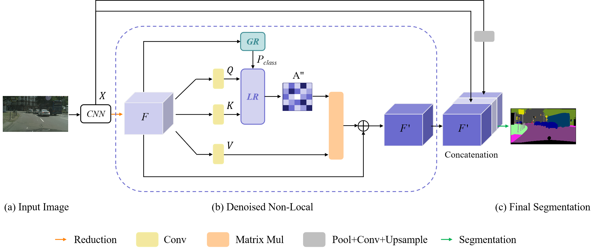

# Denoised Non-Local Neural Network for Semantic Segmentation
[](https://ieeexplore.ieee.org/abstract/document/10018899)

## Introduction

This repository is an official implementation of [DenoisedNL](https://ieeexplore.ieee.org/abstract/document/10018899)

<div align="center">
  
</div><br/>

We inventively propose a denoised NL network, which consists of two primary modules, i.e., the global rectifying (GR) block and the local retention (LR) block, to eliminate the interclass and intraclass noises, respectively. First, GR adopts the class-level predictions to capture a binary map to distinguish whether the selected two pixels belong to the same category. Second, LR captures the ignored local dependencies and further uses them to rectify the unwanted hollows in the attention map. The experimental results on two challenging semantic segmentation datasets demonstrate the superior performance of our model. Without any external training data, our proposed denoised NL can achieve the state-of-the-art performance of 83.5% and 46.69% mean of classwise intersection over union (mIoU) on Cityscapes and ADE20K, respectively. 

## Requirements:
```
pytorch==1.6.0
```

## Citation
If you found our method useful in your research, please consider citing

```
@article{song2023denoised,
  title={Denoised non-local neural network for semantic segmentation},
  author={Song, Qi and Li, Jie and Guo, Hao and Huang, Rui},
  journal={IEEE Transactions on Neural Networks and Learning Systems},
  year={2023},
  publisher={IEEE}
}
```
